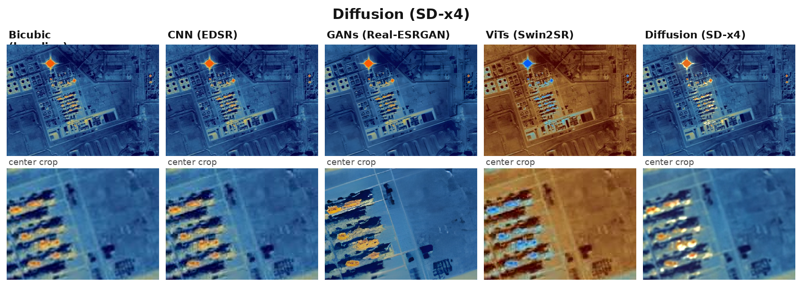

# Image Super-Resolution Model Comparison

Compare four super-resolution architectures on one low-resolution image:

| Folder | Architecture | Model | Scales | Theory |
|---|---|---|---|---|
| `CNN_models` | CNN | EDSR (`super-image`) | 2, 3, 4 | [`theory.txt`](CNN_models/theory.txt) |
| `GANs_model` | GAN | Real-ESRGAN (official weights) | 2, 4 | [`theory.txt`](GANs_model/theory.txt) |
| `ViTs_model` | Vision Transformer | Swin2SR (`transformers`) | 2, 4 | [`theory.txt`](ViTs_model/theory.txt) |
| `Diifusion_model` | Diffusion | SD x4 Upscaler (`diffusers`) | 4 | [`theory.txt`](Diifusion_model/theory.txt) |

Each folder ships a standalone `infer.py` that downloads its pre-trained
weights on first use, plus a `theory.txt` explaining how that family of
models works.

## About the models

Four architectures, each representing a different generation of deep-learning
super-resolution. They treat the task very differently and the result shows in
the output:

| Model | Family | How it works | Look & feel | Weak spot |
|---|---|---|---|---|
| **EDSR** | CNN | Single pass of convolutional filters; residual learning predicts only the missing high-frequency detail and adds it back. | Clean, smooth, noise-free | Can look slightly soft / blurry |
| **Real-ESRGAN** | GAN | A Generator creates details while a Discriminator judges them against real photos; perceptual loss keeps realistic micro-texture. | Crisp, gritty, textured | Can "hallucinate" unnatural artifacts |
| **Swin2SR** | Vision Transformer | The image is cut into patches (tokens); shifted-window self-attention models long-range relationships, then sub-pixel conv re-assembles them at high res. | Mathematically sharp, flawless edges | Heavier compute for large images |
| **SD x4 Upscaler** | Diffusion | A U-Net iteratively denoises a noise canvas guided by the LR image over many steps. | Hyper-realistic, plausible novel detail | Slow; needs many steps |

### In summary

- **CNN** is the workhorse: fast, stable, trustworthy — good for medical/satellite
  imagery and cleanup.
- **GAN** adds texture punch, great for games, anime and compressed web art,
  at the price of possible fake details.
- **ViT** gives the cleanest geometry — ideal for text, architecture and
  structured patterns.
- **Diffusion** is the slowest but most "creative"; best for human faces and
  photo restoration where realism beats speed.

Deeper explainers and side-by-side comparisons live in each
`<model>/theory.txt`.

## Example output

Upscaling `building.jpeg` at 4x with all four models produces a labelled grid
(overview + zoomed-in center crop per model, bicubic as baseline):



The same grid at 2x is written to `results/comparison_x2.png`. Every model's
standalone output and the bicubic baseline are also saved under `results/`.

## Requirements

Python 3.10+ and PyTorch (CUDA optional but recommended for speed).

```bash
# GPU install of PyTorch first (adjust cu version to your driver), e.g.
pip install torch==2.7.1 torchvision --index-url https://download.pytorch.org/whl/cu126

pip install -r requirements.txt
```

## Usage

Run every model on an image and build a side-by-side comparison grid:

```bash
python3 main_test.py --input path/to/low_res.png --scale 4
```

Optional ground-truth metrics (PSNR / SSIM against the HR image):

```bash
python3 main_test.py --input lr.png --scale 4 --gt hr.png --device cuda
```

Each model can also be run on its own:

```bash
python3 CNN_models/infer.py        --input low_res.png --scale 4 --output edsr.png
python3 GANs_model/infer.py        --input low_res.png --scale 4 --output esrgan.png
python3 ViTs_model/infer.py        --input low_res.png --scale 4 --output swin2sr.png
python3 Diifusion_model/infer.py   --input low_res.png --output diffusion.png
```

### What gets produced

Running `main_test.py --scale 4` writes into `results/`:

- `bicubic/<name>_bicubic_x4.png` — the reference baseline
- `<model>/<name>_<model>_x4.png` — each model's output
- `comparison_x4.png` — labelled grid: overview + zoomed center crops
- `metrics_x4.txt` — PSNR / SSIM / timing table (only with `--gt`)

### Common flags

- `--scale {2,4}` upscale factor (4 is supported by all models)
- `--device {auto,cuda,cpu}` — `auto` uses CUDA when available
- `--steps`, `--seed` — diffusion denoising steps / RNG seed
- `--cell`, `--zoom` — comparison-grid cell width and zoom factor
- `--tile N` (Real-ESRGAN only) — tile the forward pass to bound GPU memory

## Project layout

```
.
├── main_test.py              # SwinIR-style runner: all models + metrics
├── requirements.txt
├── utils/
│   ├── __init__.py
│   └── image_utils.py        # shared I/O, padding, PSNR/SSIM, grid builder
├── CNN_models/               # EDSR
│   ├── infer.py
│   └── theory.txt
├── GANs_model/               # Real-ESRGAN
│   ├── infer.py
│   ├── rrdbnet_arch.py       # vendored RRDBNet (BasicSR, Apache-2.0)
│   ├── weights/              # auto-downloaded checkpoints
│   └── theory.txt
├── ViTs_model/               # Swin2SR
│   ├── infer.py
│   └── theory.txt
└── Diifusion_model/          # Stable Diffusion x4 Upscaler
    ├── infer.py
    └── theory.txt
```

## Notes on weights & licenses

- **EDSR** — `eugenesiow/edsr-base` on Hugging Face Hub (auto-downloaded).
- **Real-ESRGAN** — official `xinntao/Real-ESRGAN` `.pth` files into
  `GANs_model/weights/` (BSD-3-Clause). RRDBNet is vendored from
  [BasicSR](https://github.com/xpixelgroup/BasicSR) (Apache-2.0).
- **Swin2SR** — `caidas/swin2sr-*` on Hugging Face Hub (MIT).
- **SD x4 Upscaler** — `stabilityai/stable-diffusion-x4-upscaler`
  (~3.5 GB fp16, CreativeML OpenRAIL-M). Consider `--steps 20` for a
  balance of quality and runtime.

All weights are fetched on first run; no checkpoints are stored in this repo.